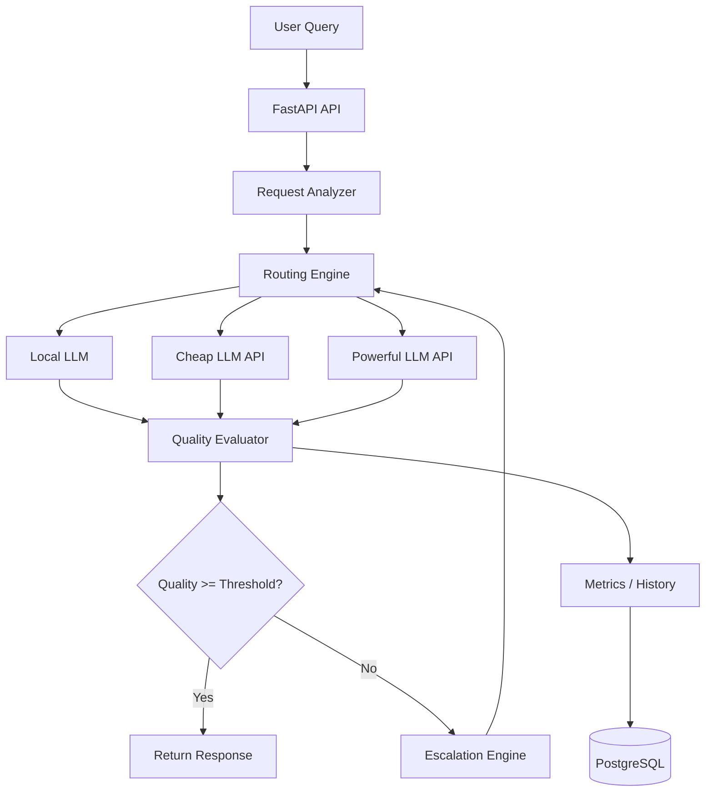

# AURA — Adaptive Unified Routing Architecture

> Route intelligently. Escalate only when necessary. Minimize AI cost without sacrificing quality.

## Why AURA?

Applications frequently send every request to the same powerful model even when many requests could be handled by smaller/local models. 

This causes:
* Higher inference/API costs
* Higher latency
* Unnecessary use of expensive models
* Poor scalability

AURA attempts to address this through adaptive model selection. The main product is an **LLM routing/orchestration engine** that minimizes LLM/API costs while maintaining a configurable response-quality threshold.

## Existing Solutions & Our Differentiation

Existing LLM gateways and routers already provide capabilities such as:
* Multi-provider abstraction
* Routing
* Fallbacks
* Cost tracking
* Latency-aware routing
* Budgets
* Load balancing

AURA focuses on the combination of:
```text
Zero-cost local-first inference
             +
Quality-gated escalation
             +
Multi-dimensional request analysis
             +
Configurable cost/quality policies
             +
Historical routing feedback
```

> "Instead of treating routing as a one-time model selection problem, AURA treats it as a closed-loop optimization problem: select the cheapest suitable model, evaluate the result, escalate when necessary, and use the resulting feedback to improve future routing decisions."

## How It Works

AURA supports a closed-loop process to intelligently choose between a local/zero-cost LLM, a low-cost API LLM, or a powerful/high-cost LLM:

```text
User Query
     ↓
Request Analysis
     ↓
Complexity / Risk / Intent Prediction
     ↓
Routing Decision
     ↓
Local or Cheap LLM
     ↓
Quality Evaluation
     ↓
  ┌──┴──┐
  │     │
Good   Poor
  │     │
Return  Escalate
        ↓
   More Capable LLM
        ↓
   Final Response
```

### 1. Quality-Gated Escalation
The router does not rely on a simple static rule (e.g., Easy → Cheap, Hard → Expensive). Instead, it can initially use a cheaper/local model. The response is then evaluated. If the response quality is below the required threshold, the request is automatically escalated to a more capable model.

### 2. Zero-Cost First Architecture
Whenever practical, the system should prefer local inference before paid APIs. 
*(Note: "zero-cost" refers to avoiding API inference cost through local models; local inference still consumes CPU/GPU resources.)*

### 3. Multi-Dimensional Routing (Planned)
The router will consider multiple request characteristics, not just "easy vs hard." 
A request profile may conceptually look like this:
```json
{
  "complexity": 0.82,
  "reasoning_required": 0.91,
  "coding_required": 0.74,
  "factual_risk": 0.62,
  "context_length": 0.43,
  "latency_sensitivity": 0.30
}
```

### 4. Configurable Routing Policies (Planned)
AURA is designed to support different optimization modes (Maximum Savings, Balanced, Maximum Quality, Maximum Speed) to adjust the trade-offs between Cost, Quality, Latency, and Reliability.

### 5. Historical Learning (Planned)
The system is designed to record routing outcomes (query features, selected model, quality, latency, token usage, cost, escalation frequency) to improve future routing decisions.

## Architecture (Planned)



## Routing Logic (Planned)

The core logic focuses on combining cost optimization with quality and latency constraints to achieve optimal model selection.

A conceptual routing score:
```text
Score(model) =
    α × Quality
  + β × Cost Efficiency
  + γ × Latency
  + δ × Reliability
```

## Example Flows

*The following numerical values are illustrative examples of intended behavior.*

**Simple query:**
`"What is the capital of France?"`
```text
Complexity = Low
      ↓
Local Model
      ↓
Quality = 0.98
      ↓
ACCEPT
      ↓
API Cost = $0
```

**Complex query:**
`"Explain the computational complexity of transformer self-attention and derive why it scales quadratically with sequence length."`
```text
Complexity = High
      ↓
Local Model
      ↓
Quality = 0.61 ❌
      ↓
Escalate
      ↓
Powerful Model
      ↓
Quality = 0.94 ✅
      ↓
Return
```

## Tech Stack (Planned)

* **Backend**: Python, FastAPI
* **Frontend**: React / Next.js
* **Routing**: Python routing engine (Rule-based + ML-based decision logic)
* **ML**: MiniLM / DistilBERT (for classification)
* **Local inference**: Ollama, Local Gemma / Qwen / Llama-family model
* **LLM gateway**: LiteLLM (where appropriate)
* **Database & Caching**: PostgreSQL, Redis
* **Observability**: Langfuse (or equivalent)
* **Deployment**: Docker, Docker Compose
* **Testing**: Pytest

## Project Structure

*Note: The repository is currently empty and the codebase is in the active planning phase. A structured folder layout (e.g., `backend/`, `frontend/`, `tests/`) will be established as implementation begins.*

## Getting Started (Planned)

Once the implementation is available, the setup process will involve:
1. Cloning the repository
2. Installing dependencies
3. Configuring environment variables (e.g., LLM API keys, Database URLs)
4. Starting local LLM servers (if applicable)
5. Starting the backend and frontend (or using Docker Compose)

## Dashboard (Planned)

A dashboard is planned to visualize metrics such as:
* Total requests and model distribution
* Estimated total cost and savings
* Average latency and quality
* Escalation rate

*Example conceptual dashboard:*
```text
┌──────────────────────────────────────┐
│         AURA ROUTING ANALYTICS       │
├──────────────────────────────────────┤
│ Requests              1,240          │
│ Local                  62%           │
│ Cheap API              27%           │
│ Powerful API           11%           │
│ Estimated Savings      79.3%         │
│ Avg Quality             92.4%        │
│ Avg Latency             480 ms       │
└──────────────────────────────────────┘
```

## Benchmarking (Planned)

The project will be evaluated by comparing:
```text
Baseline: Always use powerful model
```
versus:
```text
AURA: Adaptive routing
```
Metrics to be tracked: Total cost, cost/request, average latency, quality score, escalation rate, and percentage of requests handled without expensive inference.

## Hackathon Demo (Planned)

For evaluation purposes, the following demos are intended:

### Demo 1 — Simple request
```text
Query
 ↓
Complexity Detection
 ↓
Local Model
 ↓
Quality Gate
 ↓
ACCEPT
```
Will show: Model selected, latency, cost, and quality score.

### Demo 2 — Difficult request
```text
Query
 ↓
Local Model
 ↓
Quality Gate ❌
 ↓
Escalation
 ↓
Powerful Model
 ↓
Quality Gate ✅
```
Will show: Why escalation happened, quality improvement, additional cost, and final model.

### Demo 3 — Analytics
Will show: Requests routed, model distribution, estimated cost savings, quality maintained, and escalation rate.

## Judge FAQ

**"LLM routers already exist. What's special about this?"**  
Existing routers already solve model routing and infrastructure concerns. AURA's design focus is a closed-loop, quality-aware optimization flow where a request can begin with zero-cost/local inference, be evaluated, and escalate only when the response does not satisfy the configured quality requirement.

**"Why not always use the best model?"**  
The best models incur significantly higher inference costs and latency. Many queries do not require state-of-the-art reasoning and can be handled faster and cheaper by smaller models.

**"Why not always use the cheapest model?"**  
Quality-sensitive and reasoning-heavy requests require stronger models; using the cheapest model blindly would result in poor, unhelpful, or hallucinated responses.

**"How do you know the cheap model's answer is good?"**  
A dedicated quality evaluation layer evaluates the response before it is returned to the user. We recognize that automated evaluation has limitations, but it significantly reduces edge cases.

**"Is zero-cost really zero cost?"**  
No. "Zero-cost" strictly refers to avoiding per-request API charges. Local inference still consumes compute, electricity, and hardware resources.

**"Can the router learn?"**  
A historical feedback architecture is planned. Over time, data such as query features, selected models, and evaluation outcomes will be stored to inform future routing decisions.

**"What happens if the powerful model is unavailable?"**  
Fallback routing mechanisms to alternative providers are planned as a reliability measure.

## Limitations

* Quality evaluation is imperfect.
* Local models consume hardware resources.
* Router predictions can be wrong.
* Model quality changes across providers/versions.
* Cost estimates depend on provider pricing.
* Evaluation itself can introduce latency/cost.
* Some tasks require powerful models regardless of routing.

## Future Work

1. Online routing-policy learning
2. Multi-model ensemble routing
3. Context-aware routing
4. Automatic model benchmarking
5. Shadow evaluation (evaluating requests in the background with another model for quality comparison)
6. Provider outage-aware routing
7. Dynamic token-budget allocation
8. Prompt compression before expensive inference
9. Semantic caching
10. Privacy-aware routing
11. Reinforcement-learning-based routing
12. Per-user/per-application budgets
13. Carbon/energy-aware routing

## License

License: Not yet specified.
